# Edu2Job: AI-Powered Job Role Prediction System


[](LICENSE)
[](https://www.python.org/)
[](https://flask.palletsprojects.com/)


##  Project Overview
**Edu2Job** is a full-stack web application that uses machine learning to predict suitable job roles for students based on their academic profiles, skills, and experience. The system provides personalized career recommendations with confidence scores and comparative market insights.


##  Key Features
###  Authentication & Security
* **JWT-based authentication** with secure token storage
* **Google OAuth 2.0 integration** for social login
* **Password encryption** using Flask-Bcrypt
* **Rate limiting** (100 requests/hour per IP)
* **Security headers** (XSS protection, CSRF prevention)
* **Password Policy:** Strong password validation (Min 8 chars, 1 uppercase, 1 number).
* **Encryption:** Passwords hashed using **Flask-Bcrypt**.

###  ML-Powered Prediction Engine
* **XGBoost Classifier Model** trained on structured tabular data.
* **Top-3 Predictions** Generates the top 3 recommended roles with confidence scores (e.g., "92% Match").
* **Explainable AI:** Provides text justification for *why* a role was chosen based on specific skills (e.g., "Matched due to Python & SQL").
* **Multi-label skills encoding** with noise reduction
* **Preprocessing:** Automated pipeline for Label Encoding, Scaling, and Skill Parsing.

###  User Dashboard
* **Profile management** with academic details
* **Interactive prediction history** with feedback system
* **Market comparison charts** (CGPA vs market average)
* **Trending job visualization** using **Chart.js**


###  Admin Panel
* **System Dashboard:** Real-time overview of total users, active logs, and feedback ratings.
* **Dataset Management:** Upload new training datasets (`.csv`) to trigger **automated background model retraining**.
* **Quality Assurance:** Review prediction logs and **Flag** incorrect predictions for future refinement.
* **Logs:** Centralized error and activity logging via `RotatingFileHandler`.

---

##  Tech Stack

| Component | Technologies |
| :--- | :--- |
| **Frontend** | HTML5, CSS3, JavaScript (Vanilla), Chart.js, Font Awesome |
| **Backend** | Python, Flask, Flask-JWT-Extended, Flask-Limiter, Flask-Bcrypt |
| **Database** | MongoDB (PyMongo) |
| **Machine Learning** | XGBoost, Scikit-Learn, Pandas, NumPy |
| **Auth** | Authlib (Google OAuth), JWT |

---

##  System Architecture

The following diagram illustrates how the User, Frontend, Backend, and Database interact:

```mermaid
graph TD
    %% Nodes
    User((👤 User))
    Frontend[💻 Frontend UI<br/>HTML5, JS, Chart.js]
    Auth[🔐 Auth Layer<br/>Google OAuth / JWT]
    Backend[⚙️ Backend API<br/>Python Flask]
    DB[(🗄️ MongoDB<br/>User Data & History)]
    ML[🧠 ML Model<br/>XGBoost Classifier]

    %% Connections
    User -->|1. Login/Register| Frontend
    Frontend -->|2. Auth Request| Auth
    Auth -->|3. Validate| Backend
    Frontend -->|4. Input Profile| Backend
    Backend <-->|5. Read/Write Data| DB
    Backend -->|6. Send Vector| ML
    
    %% Return Paths (Dotted Lines)
    ML -.->|7. Return Top 3 Roles| Backend
    Backend -.->|8. JSON Response| Frontend
```


---

##  Project Structure
```
Edu2Job/ 
├── backend/ 
│   ├── logs/                     # Application logs
│   ├── app.py                    #Main Flask Application   
│   ├── seed_data.py             # Database Seeder Script
│   └── .env 
├── frontend/              # HTML templates
│   ├── index.html         # Login/Registration
│   ├── dashboard.html      # User dashboard
│   ├── google_callback.html     # OAuth callback page     
│   └── admin_dashboard.html     #User Dashboard                     
├── ml-model/               # ML artifacts directory
│   ├── backups/
│   ├── train_model.py      # ML model training script
│   ├── career_model.pkl
│   ├── label_encoders.pkl
│   ├── scaler.pkl
│   ├── skills_mlb.pkl
│   ├── feature_names.pkl
│   ├── feature_selectors.pkl 
│   ├── metadata.pkl
│   └── career_dataset.csv  # Training data  
├── Images/
├── .gitignore
├── requirements.txt 
└── README.md              
```
    
##  Installation & Setup

 ### Prerequisites
* **Python 3.8+**
* **MongoDB instance** (local or Atlas)
* **Google OAuth credentials**

### 1. Clone Repository
   
```
bash

git clone <repository-url>
cd Edu2Job
```

### 2. Install Dependencies

```
bash

pip install -r requirements.txt
```

### 3. Configure Environment Variables
   
Create a ```.env``` file in the root directory:
```
env

FLASK_SECRET_KEY=your_secret_key_here
MONGO_URI=mongodb://localhost:27017/edu2job
JWT_SECRET_KEY=your_jwt_secret
GOOGLE_CLIENT_ID=your_google_client_id
GOOGLE_CLIENT_SECRET=your_google_client_secret
```

### 4. Prepare ML Model
```
bash

#Ensure career_dataset.csv is in ml-model directory

cd ml-model
python train_model.py
```

### 5. Run Application
```
bash

python app.py
```

The application will be available at ```http://localhost:5000```


##  Model Training

### Dataset Requirements

The CSV file must contain these columns:

* ```degree```, ```specialization```, ```cgpa```, ```graduation_year```
* ```skills``` (comma-separated), ```job_role``` (target)
* ```certifications```, ```internship_experience```

### Training Process

1. Upload CSV via admin panel

2. Automatic preprocessing (encoding, scaling)

3. XGBoost training with evaluation metrics

4. Artifacts saved with timestamped backups

5. Model reloaded without restarting app

##  API Endpoints

### Authentication

* ```POST /register``` - Register new user
* ```POST /login``` - User login (JWT)
* ```GET /login/google``` - Google OAuth login
* ```POST /api/change_password``` - Password change

### User Operations

* ```GET /api/profile``` - Get user profile
* ```PUT /api/update_profile``` - Update profile
* ```POST /api/predict``` - Get job predictions
* ```GET /api/history``` - Get Prediction history
* ```POST /api/feedback``` - Submit feedback

### Analytics

* ```GET /api/stats/job_distribution``` - Job trends
* ```GET /api/stats/comparison``` - Market comparison
* ```GET /api/stats/degree_job``` - Degree statistics

### Admin Operations

* ```GET /api/admin/users``` - List all users
* ```GET /api/admin/stats``` - System statistics
* ```POST /api/admin/flag_prediction``` - Flag incorrect predictions
* ```POST /api/admin/upload_dataset``` - Upload new training data

##  Usage Guide

### For Students

1. **Register/Login** using email or Google

2. **Complete profile** with academic details

3. **Add skills** focusing on technical competencies

4. **Get predictions** with confidence scores

5. **View history** and provide feedback

6. **Compare** with market benchmarks

### For Administrators

1. Access ```/admin``` with admin credentials

2. Monitor system statistics

3. Manage users and predictions

4. Flag incorrect predictions for review

5. Upload new datasets for model improvement

##  Security Features

* **Input sanitization** against XSS attacks
* **Password validation** (min 8 chars, uppercase, number)
* **JWT token expiration** management
* **Rate limiting** on login endpoints
* **Secure headers** (X-Frame-Options, XSS-Protection)
* **MongoDB injection prevention** via PyMongo

##  Performance Optimization

* **Background model training** using threading
* **Chart.js** for client-side rendering
* **Efficient ML preprocessing** pipelines
* **MongoDB indexing** for faster queries
* **Artifact caching** for model predictions

##  Troubleshooting

### Common Issues

1. **Model not loading:** Check if ```ml-model/``` contains required ```.pkl``` files

2. **MongoDB connection failed:** Verify ```MONGO_URI``` in ```.env```

3. **Google login not working:** Ensure OAuth credentials are correct

4. **Prediction errors:** Check if skills exist in trained vocabulary

## Logs

* Application logs: ```logs/edu2job.log```
* Training logs: Console output during model training
* Backup logs: Check ```backups/``` directory for previous models

##  Future Enhancements

* **Real-time notifications** for new job matches
* **Resume parser** for automatic profile creation
* **Company matching** based on skills
* **Interview preparation** module
* **Mobile application** (React Native/Flutter)
* **Advanced analytics** with predictive trends
* **Multi-language support**

##  Contributing

We welcome contributions! Here's how you can help:

1.**Fork the repository**

2.**Create a feature branch** ( ```git checkout -b feature/AmazingFeature``` )

3.**Commit your changes** ( ```git commit -m 'Add AmazingFeature'``` )

4.**Push to the branch** ( ```git push origin feature/AmazingFeature``` )

5.**Open a Pull Request**

##  License

This project is licensed under the MIT License - see the LICENSE file for details.

##  Acknowledgments

* **XGBoost Development Team** for the powerful ML library
* **Flask Community** for excellent documentation 
* **Chart.js Team** for beautiful data visualization
* **Font Awesome** for icons
* **Google Fonts** for typography

##  Support

For support, **email:** [nandinisurapureddy4@gmail.com] or create an issue in the GitHub repository.

**Note:** This system is for educational purposes. Always verify career advice with professional counselors.
